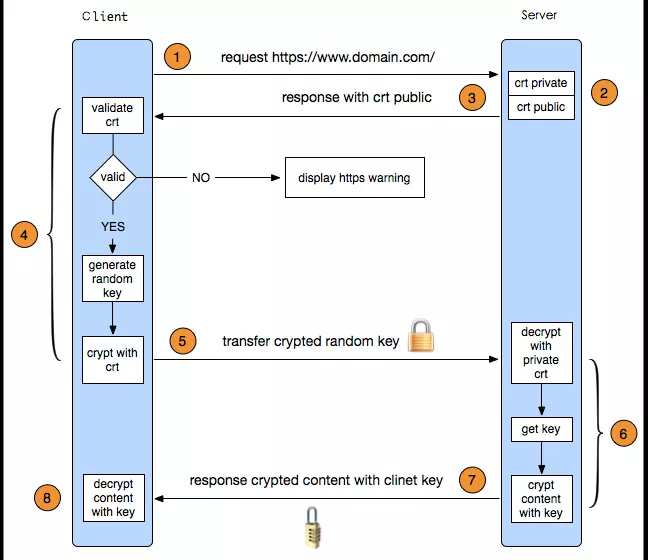

## 背景

我们知道，HTTP 请求都是明文传输的，所谓明文指的是没有经过加密的信息，如果 HTTP 请求被黑客拦截，并且里面含有银行卡密码等敏感数据的话，会非常危险。

为了解决这个问题，Netscape 公司制定了 HTTPS 协议，可以将数据加密传输，也就是传输的是密文，即便黑客在传输过程中拦截到数据也无法破译，这就保证了网络通信的安全。

HTTPS 在 HTTP 的基础下加入 SSL 层，即 SSL 层在 HTTP 和 TCP 层之间。

---

## 先讲些密码学基础

**明文**：指的是未被加密过的原始数据

**密文**：明文被某种加密算法加密后，会变成密文，从而确保原始数据的安全。密文也可以被解密，得到原始的明文。

**密钥**：密钥是一种参数，它是在明文转换成密文或将密文转换成明文的算法中输入的参数。密钥分为对称密钥与非对称密钥，分别应用在对称加密和非对称加密。

**对称加密**：又叫私钥加密，即信息的发送方和接收方使用同一个密钥去加密和解密数据。对称加密的特点是算法公开、加密和解密速度快，适合于对大数据量进行加密。

加密过程如下：明文 + 加密算法 + 私钥 => 密文

解密过程如下：密文 + 加密算法 + 私钥 => 明文

对称加密中用到的密钥叫做私钥，私钥表示个人私有密钥，即该密钥不能被泄露。其加密过程中的私钥和解密过程中用到的私钥是同一密钥，这也是对称加密之所以被称为“对称”的原因。由于对称加密的算法是公开的，所以一旦私钥被泄露，那么密文就很容易被破解，所以对称加密的缺点是密钥安全管理困难。

**非对称加密**：又叫公钥加密。与对称加密相比，其安全性更好。对称加密的通信双方使用相同的密钥，如果一方的密钥遭泄露，那么整个通信就会被破解。而非对称加密使用一对密钥，即公钥和私钥，且二者成对出现。私钥被自己保存，不能对外泄露。公钥指的是公共的密钥，任何人都可以获得该密钥。用公钥或私钥中的任何一个进行加密，用另一个进行解密。

被公钥加密过的密文只能被私钥解密，过程如下：

明文 + 加密算法 + 公钥 => 密文

密文 + 加密算法 + 私钥 => 明文

被私钥加密过的密文只能被公钥解密，过程如下：

明文 + 加密算法 + 私钥 => 密文

密文 + 加密算法 + 公钥 => 明文

由于加密和解密使用了两个不同的密钥，这就是非对称加密“非对称”的原因。非对称加密的缺点是加密和解密花费时间长、速度慢，只适合对少量数据进行加密。

---

## HTTPS 通信过程

HTTPS 协议 = HTTP 协议 + SSL / TLS 协议

**SSL**：Secure Sockets Layer，即安全套接层协议，是为网络通信提供安全及数据完整性的一种安全协议。SSL 协议在 1994 年被 Netscape 发明，后来各个浏览器均支持 SSL，其最新版本是 3.0。
s
**TLS**：Transport Layer Security，即安全传输协议，它建立在 SSL 3.0 协议规范之上，TLS 和 SSL 之间存在显著的差别，主要是它们所支持的加密算法不同，所以它们不能互操作。但是在我们理解 HTTPS 的过程中，我们可以把 SSL 和 TLS 看作是同一个协议。

HTTPS 为了兼容安全和效率，同时使用了对称加密和非对称加密。数据是被对称加密传输的，对称加密过程需要客户端的一个密钥，为了确保能把该密钥安全传输到服务端，采用非对称加密进行加密传输。

总的来说，对数据进行对称加密，对称加密所要使用的密钥通过非对称加密传输。

1. 客户端访问服务器

2. 服务端有一个公钥一个私钥

3. 返回公钥给客户端

4. 客户端验证公钥是否有效（怎么验证先不说了）

5. 如果无效则显示 HTTPS 警告，并且无法继续，如果有效则继续

6. 客户端生成一个随机 Key 值

7. 将这个 Key 用服务端给的公钥进行**非对称加密**

8. （即，明文 + 加密算法 + 公钥 => 密文）

9. （即，Key + 加密算法 + 公钥 => 密文）

10. 客户端将密文传给服务端

11. 服务端用自己的私钥进行解密得到客户端的 Key 值

12. （即，密文 + 加密算法 + 私钥 => 明文）

13. （即，密文 + 加密算法 + 私钥 => Key）

14. 服务端告诉客户端已拿到 Key 值

15. **至此 SSL 层连接已建立完毕，下面开始 HTTP 通信**

15. 客户端用 Key 值（当作私钥）对内容（即明文）进行**对称加密**

16. 客户端将加密后的数据传给服务端，即 **HTTP 请求**

16. 服务端用 Key 值解出客户端实际发送的内容

14. 服务端用 Key 值（当作私钥）对内容（即明文）进行**对称加密**

15. 服务端将加密后的数据传给客户端，即 **HTTP 响应**

17. 客户端用 Key 值解出服务端实际发送的内容

20. 最后由客户端断开连接

---

## HTTPS 流程图

备注：这个流程图最后几步不够详细

---

## HTTPS 的缺点及解决办法

### 缺点

HTTPS 比 HTTP 慢了 2 到 100 倍。

SSL 的慢分两种。

一种是通信慢，除去和 TCP 连接、HTTP 请求响应外，还必须进行 SSL 通信，因此整体上处理的通信量不可避免会增加。

另一点是 SSL 必须进行加密处理，在服务器和客户端都要进行加密和解密的运算过程，因此会消耗更多的 CPU 及内存资源。

### 解决办法

使用 SSL 加速器（HTTPS 专用服务器）硬件进行加速，可以提升 SSL 的计算速度。

或者对非敏感信息时用 HTTP 通信，只有包含敏感信息的通信时才使用 HTTPS。

---

## 特点

HTTPS 为什么使用混合加密机制？

因为非对称加密的计算速度很慢，相比之下对称加密的计算速度就快很多。所以只有一开始时建立 SSL 层时用非对称加密，后面的 HTTP 通信过程都使用的是对称加密。

---

## 常见相关算法

### 非对称加密算法

RSA、DSA / DSS

### 对称加密算法

AES、RC4、3DES

### HASH 算法

MD5、SHA1、SHA256