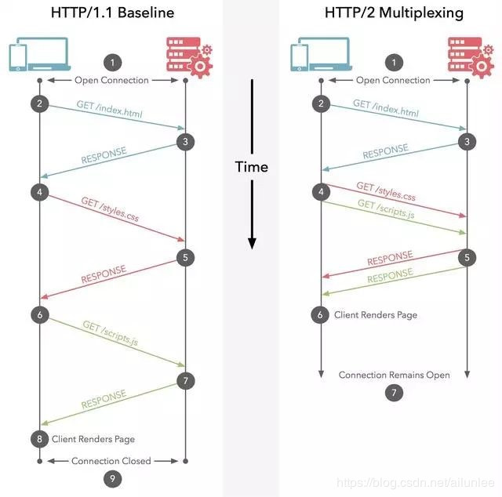
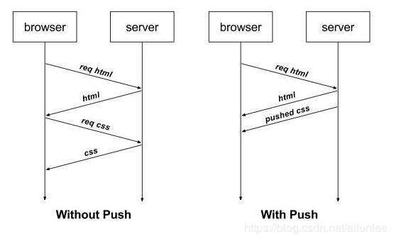

## 时间

HTTP 0.9 ———— 1991 年

HTTP 1.0 ———— 1996 年

HTTP 1.1 ———— 1999 年

HTTP 2.0 ———— 2015 年

---

## HTTP 1.0 和 1.1 的区别

### 长连接

HTTP 1.0 使用非持久连接，即一个 TCP 连接只传输一个资源文件。

HTTP 1.1 支持持久连接，也就是长连接，在一个 TCP 可以传输多个 HTTP 请求和响应，减少了建立和关闭连接的消耗和延迟，1.1 默认就是长连接。

### 带宽

HTTP 1.0 存在浪费带宽的现象，例如客户端只需要某个对象一小部分，但服务器却将整个对象发送了过来，并且不支持断点续传功能。

HTTP 1.1 支持只传送对象的一部分，这样客户端有一部分资源后，只需要跟服务器请求另外的部分资源即可，所以 1.1 支持断点续传的功能。

### 缓存

HTTP 1.0 主要用 Expires 等字段

HTTP 1.1 添加了 Cache-Control 等字段，供可选择更多的缓存策略

---

## HTTP 1.1 和 2.0 的区别

### 多路复用

HTTP 2.0 使用了多路由的技术，做到同一个连接并发处理多个请求

### 头部数据压缩

HTTP 请求和响应都是由状态行、请求 / 响应头部、消息主体三部分组成

一般而言，消息主体都会经过 gzip 压缩，但状态行和头部却没有压缩，以纯文本传输

随着 Web 功能越来越复杂，每个页面产生的请求数也越来越多，导致消耗在头部的流量越来越多

HTTP 1.1 不支持对 header 数据压缩，HTTP 2.0 现在支持了

### 服务器推送

HTTP 1.1 中每一个请求都必须是明确的，在浏览器解析 HTML 页面的时候，服务器必须等待浏览器，这时候网络经常是空闲和未充分使用的。

为了改善延迟，HTTP 2.0 引入了 Server Push，它允许服务器推送资源给浏览器。

