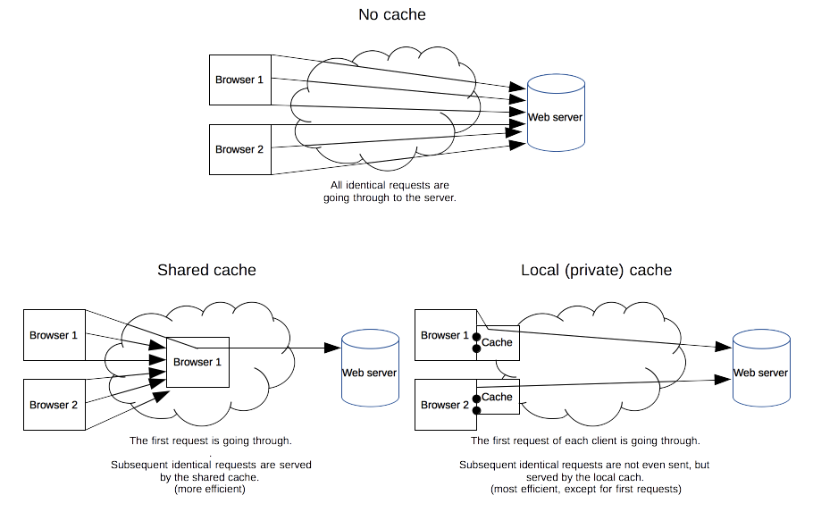
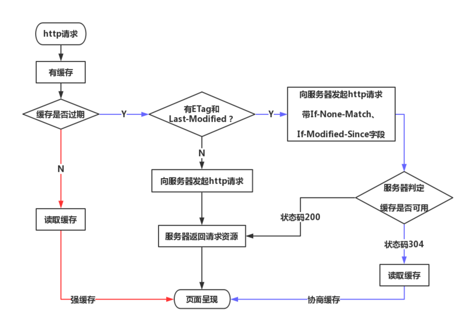

## 私有缓存和公有缓存

缓存是一种保存资源副本并在下次请求时直接使用该副本的技术。

当 Web 缓存发现请求的资源已经被存储，它会拦截请求，返回该资源的拷贝，而不会去源服务器重新下载，这样的好处是可以缓解服务器压力。

### 私有缓存（浏览器缓存）

只能用于单独用户。浏览器缓存拥有用户通过 HTTP 下载的所有文档。

这些缓存为浏览过的文档提供向后、向前导航，保存网页，查看源码等功能，可以避免再次向服务器发起多余的请求。

他同样可以提供缓存内容的离线浏览。

下面的强缓存和协商缓存就属于私有缓存。

### 公有缓存

共享缓存储存的响应能够被多个用户使用。（比如 CDN）

---

## HTTP 缓存请求响应头标识

先了解以下字段是必须的

### Cache-Control

HTTP 1.1 定义的 Cache-Control 头用来区分对缓存机制的支持情况。

请求头和响应头都支持这个属性。

**Cache-Control: no-store**

禁止进行缓存

每次由客户端发送请求都会下载完整的响应内容。

**Cache-Control: no-cache**

强制确认缓存

缓存，但在使用缓存前会请求服务器判断缓存的资源是否是最新的。

**Cache-Control: public**

公共缓存

该指令表示此响应可以被任何中间人（比如中间代理、CDN 等）缓存。

**Cache-Control: private**

私有缓存

该响应是专用于某个用户的，中间人不能缓存此响应，该响应只能应用于浏览器私有缓存中。

**Cache-Control: max-age=<seconds>**

缓存过期时间

表示资源能够被缓存的最大时间，请求后的 seconds 秒内不再发起请求，与下方的 Expires 类似，但优先级比 Expires 更高。

### Expires

中文翻译为 “失效、终止、到期”

响应头，代表资源到期时间，由服务器提供，GMT 格式日期，是 HTTP 1.0 的属性。

与 max-age 共存时优先级更低。

### Last-Modified

响应头，资源最新修改时间，由服务器告诉浏览器。

### if-Modified-Since

请求头，资源最新修改时间，由浏览器告诉服务器（其实就是上次服务器给的 Last-Modified），和 Last-Modified 进行对比，判断资源是否是最新的。

### Etag

响应头，资源标识，由服务器告诉浏览器。

### if-None-Match

请求头，缓存资源标识，由浏览器告诉服务器（其实就是上次服务器给的 Etag），和 Etag 进行对比，判断资源是否是最新的。

Etag 对比的优先级比 Last-Modified 优先级更高。

---

## 强缓存和协商性缓存

### 强缓存

不发起 HTTP 请求，直接使用本地缓存

### 协商性缓存

在使用本地缓存前，先与服务器协商，核对缓存文件是否最新

---

## 参考网站

https://www.cnblogs.com/echolun/p/9419517.html